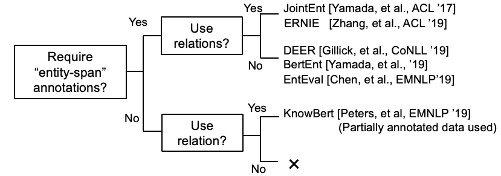
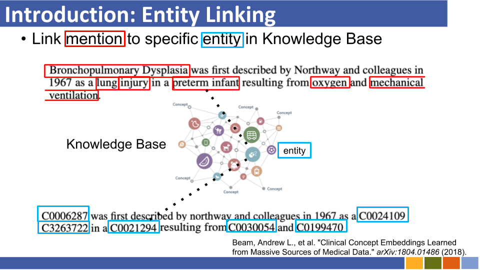
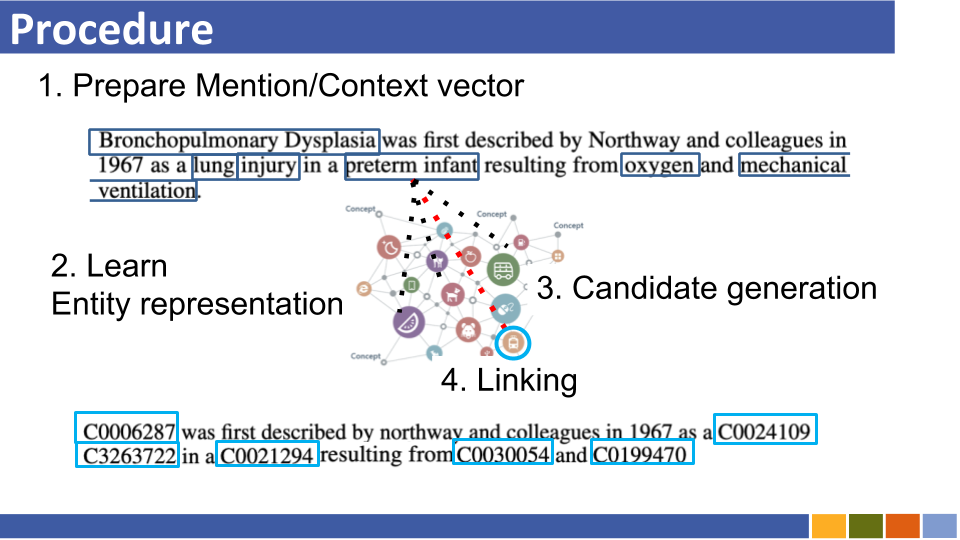
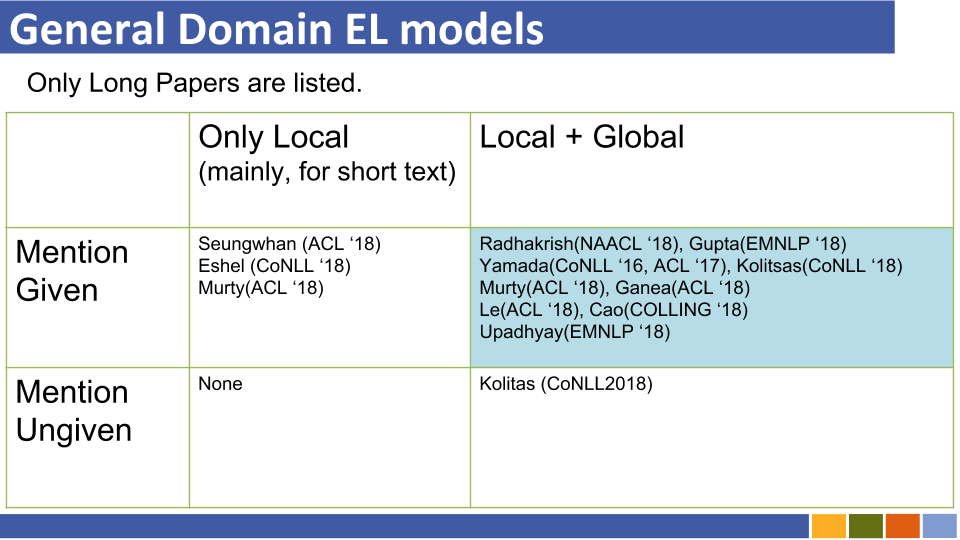
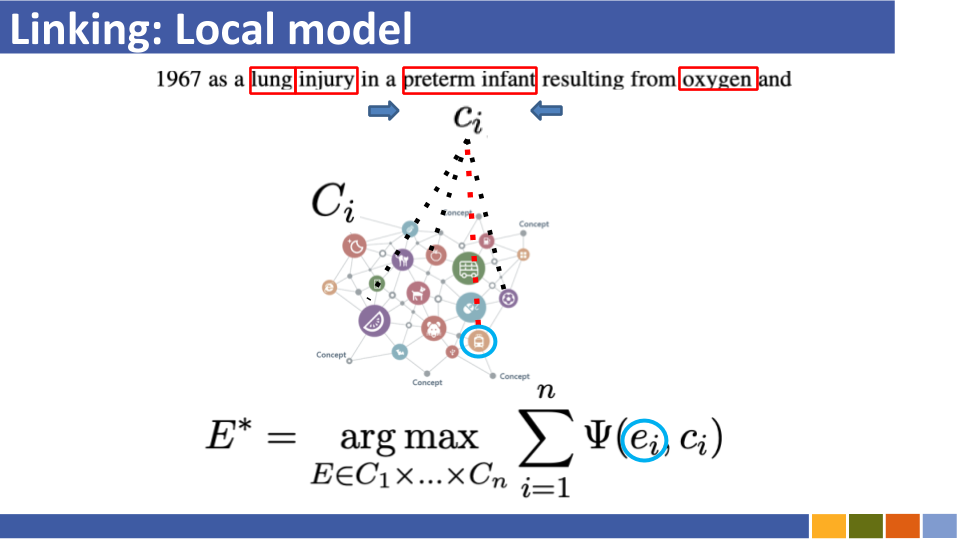

# Recent trends of Entiy Linking
This repository aims to track the progress in Entity Linking. Studies on how to prepare entity representations are also listed, as entity representations are mandatory with Entity linking.

## Contents
- [Trends(~ICLR'20)](#trendsiclr20)
- [Trends (~EMNLP'19, CoNLL'19, ICLR'19)](#trendsemnlp19-conll19-iclr19)
- [Trends (~ACL'19)](#trendsacl19)
- [Baselines (~ACL'18)](#baselinesacl18)
- [Entity Linking Introduction](#entity-linking-introductions)

### Sub contents
* [How to get entity representation?](#how-to-getprepare-entity-representations)
* [Another Trend: BERT x KB](#another-trend-bert-x-kb)
---
# Trends(~ICLR'20)

* Pretrained Encyclopedia: Weakly Supervised Knowledge-Pretrained Language Model (ICLR'20) [[paper](https://openreview.net/forum?id=BJlzm64tDH)]

  * Adding a binary prediction task classifying whether entity is replaced or not, they trained the language model. For their purpose of checking whether LM itself contains knowledge, they evaluated model with Zero-Shot Fact Completion using Wikidata triplets.  

* K-Adapter: Infusing Knowledge into Pre-Trained Models with Adapters [[paper](https://arxiv.org/abs/2002.01808)]

  * Previous LM models with knowledge injected learn knowledge during training and fail to continual learning. With adapter module which is proposed, they show entire model including adapter captures richer factual and commonsense knowledge than previous models, like RoBERTa.

---

# Trends(~EMNLP'19, CoNLL'19, ICLR'19)

* Although there seems to be research related to EL model itself, some are now studying about (how to get) "Entity Representation" itself.

## Models for entity linking

* Improving Entity Linking by Modeling Latent Entity Type Information(AAAI'20) [paper](https://arxiv.org/abs/2001.01447)

* Zero-shot Entity Linking with Dense Entity Retrieval(10th, Nov) [paper](http://arxiv.org/pdf/1911.03814)

  * Similar to [[Logeswaran, et al., ACL'19]](#Zeroshot) and [[Gillick, et al., CoNLL'19]](#DenseEnt)

  * [slides(unofficial)](https://speakerdeck.com/izuna385/zero-shot-entity-linking-with-dense-entity-retrieval-unofficial-slides)

* Entity Linking via Dual and Cross-Attention Encoders [arXiv](https://arxiv.org/abs/2004.03555)

  *  Combineing [[Gillick, et al., CoNLL'19]](#DenseEnt) with cross-attention between a mention and its candidates.

* Fine-Grained Evaluation for Entity Linking (EMNLP'19)

  * [repo](https://github.com/henryrosalesmendez/EL_exp)

* Learning Dynamic Context Augmentation for Global Entity Linking (EMNLP'19)

  * [paper](https://arxiv.org/abs/1909.02117), [repo](https://github.com/YoungXiyuan/DCA)

* Fine-Grained Entity Typing for Domain Independent Entity Linking

  * [paper](https://arxiv.org/abs/1909.05780)

* Investigating Entity Knowledge in BERT With Simple Neural End-To-End Entity Linking	(CoNLL '19) [[paper](https://www.aclweb.org/anthology/K19-1063.pdf)]

  * They proposed end-to-end EL *including candidate generation step* for the first time, by casting EL as token-classification problem.

* Global Entity Disambiguation with Pretrained Contextualized Embeddings of Words and Entities [paper](https://arxiv.org/abs/1909.00426)

## Entity Representation

* Learning Dense Representations for Entity Retrieval (CoNLL '19)

  * [paper](https://arxiv.org/abs/1909.10506), [repo](https://github.com/google-research/google-research/tree/master/dense_representations_for_entity_retrieval/)

  * They proposed no use of alias table(which was based on wikipedia statistics or prepared one) and searching all entities by brute-force/approximate nearest search for linking entity per mention.

* EntEval: A Holistic Evaluation Benchmark for Entity Representations (EMNLP '19)

  * [repo](https://github.com/ZeweiChu/EntEval)

  

* Learning Entity Representations for Few-Shot Reconstruction of Wikipedia Categories (ICLR '19)

  * [openreview](https://openreview.net/forum?id=BJgum4Qgu4)

* Knowledge Enhanced Contextual Word Representations (EMNLP '19) [[paper](https://arxiv.org/abs/1909.04164)]

  * By injecting KB entity information into the mention-span representations through BERT, they improves the quality of the masked LM and its ability to recall facts.

---

# Trends(~ACL'19)
* Trends of  leveraging all information(e.g. mention's type and definition and documents in which mention exists, etc...) seems to be disappering.

* Although Wikipedia domain can use its hyperlink(=mention-entity pairs, about 7,500,000) for training linking model, under some domain-specific situations there are not so much mention-entity pairs.

* Therefore, some papers are now challenging distant-learning and zero-shot learning of Entity linking.

  * Distant Learning

    * [Distant Learning for Entity Linking with Automatic Noise Detection](https://github.com/izuna385/papers/wiki/038_Distant_Learning_for_Entity_linking(ACL19))

      * [slides(unofficial)](https://speakerdeck.com/izuna385/distant-learning-for-entity-linking-with-automatic-noise-detection)

      * They proposed framing EL as Distant Learning problem, in which no labeled training data is available, and de-noising model for this task.

    * [Boosting Entity Linking Performance by Leveraging Unlabeled Documents](https://arxiv.org/abs/1906.01250)

  * Zero-shot Linking
  
    * [Zero-Shot Entity Linking by Reading Entity Descriptions](https://arxiv.org/abs/1906.07348)

    * [slides(unofficial)](https://speakerdeck.com/izuna385/zero-shot-entity-linking-by-reading-entity-descriptions)

    * They proposed Zero-shot EL, under which no test mentions can be seen during training. For tackling Zero-shot EL, they proposed Domain-adaptive strategy for pre-training Language model. Also, they showed that mention-entity description cross-attention is crucial for EL.

* BERT-based entity representation learning also emerged.

  * ERNIE: Enhanced Language Representation with Informative Entities [[paper](https://arxiv.org/abs/1905.07129)]

---

# Baselines(~ACL'18)

* (Commented@Nov,2019) In those days, researches for improving Entity linking **model** itself were flourishing.

* *Bold style* indicates its SoTA score of a specific dataset.

| Baseline models                                                                                      | Year      | Dataset                                                              | code                          | Run?                          | Code address                                                                                                                                                                |
|------------------------------------------------------------------------------------------------------|-----------|----------------------------------------------------------------------|-------------------------------|-------------------------------|-----------------------------------------------------------------------------------------------------------------------------------------------------------------------------|
| Entity Linking via Joint Encoding of Types,Descriptions,and Context                                  | EMNLP2017 | CoNLL-YAGO(82.9,acc),ACE2004,ACE2005,WIKI(**89.0**,f1)               | Tensorflow                    | Only Traind model is uploaded | [here](https://nitishgupta.github.io/neural-el/)                                                                                                                            |
| ┗ (Very Similar to the above) Joint Multilingual Supervision for Cross-lingual Entity Linking        | EMNLP2018 | TH-Test,McN-Test,TAC2015                                             | Pytorch                       | Checking                      | [here](https://github.com/shyamupa/xling-el)                                                                                                                                |
| Neural Collective Entity Linking(NCEL)                                                               | CL2018    | CoNLL-YAGO, ACE2004, AQUAINT,TAC2010(**91.0**,mic-p),WW              | pytorch                       | Bug                           | [here](https://github.com/TaoMiner/NCEL)                                                                                                                                    |
| Improving Entity Linking by Modeling Latent Relations between Mentions                               | ACL2018   | CoNLL-YAGO(**93.07**,mic-acc),AQUAINT,ACE2004,CWEB,WIKI(84.05,f1)    | pytorch                       | Evaluation Done               | [here](https://github.com/lephong/mulrel-nel)                                                                                                                               |
| ELDEN                                                                                                | NAACL2018 | CoNLL-PPD(93.0,p-mic),TAC2010(89.6,mic-p)                            | lua,torch(lua)                | Bug                           | [here](https://github.com/priyaradhakrishnan0/ELDEN)                                                                                                                        |
| Deep Joint Entity Disambiguation with Local Neural Attention                                         | EMNLP2017 | CoNLL-YAGO(92.22,mic-acc),CWEB,WW,ACE2004,AQUAINT,MSNBC              | lua,torch(lua)                | Train Running(2019/01/15)     | [here](https://github.com/dalab/deep-ed)                                                                                                                                    |
| Hierarchical Losses and New Resources for Fine-grainid Entity Typing and Linking                     | ACL2018   | Medmentions,Typenet                                                  | pytorch                       | Bug                           | [here](https://github.com/MurtyShikhar/Hierarchical-Typing)                                                                                                                 |
| Joint Learning of the Embedding of Words and Entities for Named Entity Disambiguation(Yamada,Shindo) | CoNLL2016 | CoNLL-YAGO(91.5,mic-acc),CoNLL-PPD(93.1,p-mic),TAC2010(85.5,mic-acc) | pytorch/Tensorflow(original), | checking                      | [Baseline(2016)](https://github.com/hiroshi-ho/EDPipline),[Baseline Original](https://github.com/wikipedia2vec/wikipedia2vec)                                               |
| Learning Distributed Representations of Texts and Entities from Knowledge Base(Yamada,Shindo)        | ACL2017   | CoNLL-PPD(**94.7**,p-mic),TAC2010(87.7,mic-acc)                      | pytorch/Keras(original)       | checking                      | [Torch](https://github.com/lephong/mulrel-nel/blob/master/nel/ntee.py), [Torch](https://github.com/AdityaAS/PyTorch_NTEE), [Original](https://github.com/studio-ousia/ntee) |

---
## How to get/prepare entity representations?

* Based on papers@December,'19

---

## Another Trend: BERT x KB

* Some researches are now trying to incorporate KB information with BERT.

  * [KEPLER: A Unified Model for Knowledge Embedding and
Pre-trained Language Representation](https://arxiv.org/abs/1911.06136) (work in progress @ Nov, '19)

  * [Integrating Graph Contextualized Knowledge into Pre-trained Language Models](https://arxiv.org/abs/1912.00147) (work in progress @ Dec, '19)

  * [K-BERT: Enabling Language Representation with Knowledge Graph](https://arxiv.org/abs/1909.07606)

* [[Petroni, et al., '19]](https://arxiv.org/abs/1909.01066) checked whether BERT *itself* has factual knowledge.

---

# Entity Linking Introductions

## Local model and Global model
* Details are wrintten in *Neural Collective Entity Linking*. [paper](http://www.aclweb.org/anthology/C18-1057)

### Trend in the point of *local* vs *global*

### What is *local*/*global* model?

---

## memo, papers to read

* separate sections into entity representation / entity LM / entity linking[Long / short text] / Entity describing?

* Do we have to add WSD(word sense disambiguation) and ESR(entity similarity relatedness) too?

* ent rep. and ent LM new papers

  * [Latent Relation Language Models](https://arxiv.org/abs/1908.07690) (Hayashi et al.,'19)

  * [Knowledge Enhanced Contextual Word Representations](https://www.semanticscholar.org/paper/Knowledge-Enhanced-Contextual-Word-Representations-Peters-Neumann/23fa28a4851d992891a4809f3f5f0ac2f53221fa) (Peters et al., IJCNLP'19)

* entity linking new papers

  * [Towards Zero-resource Cross-lingual Entity Linking](https://arxiv.org/abs/1909.13180) (Shuyan et al., EMNLP workshop '19)

  * List-only Entity Linking [paper](https://www.aclweb.org/anthology/P17-2085.pdf)

  * Joint Learning of Named Entity Recognition and Entity Linking [paper](https://arxiv.org/abs/1907.08243)
