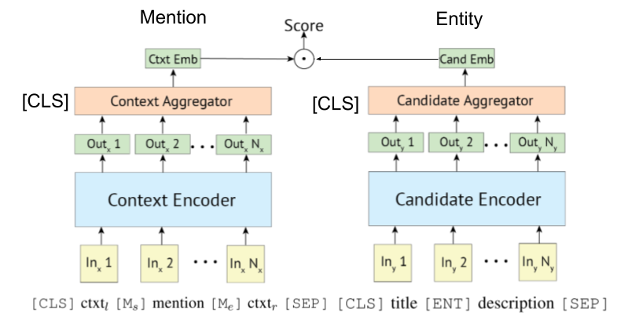

# Recent Trends of Entity Linking
This repository aims to track the progress in Entity Linking. Studies on how to prepare Entity Representations are also listed, as Entity Representations are mandatory with Entity Linking.

## Contents
- [Trends (NAACL'21 and ICLR'21)](#trends-naacl21-and-iclr21)
- [Trends (~EMNLP'20 and CoNLL'20)](#trends-emnlp20-and-conll20)
- [Trends (~ACL'20)](#trendsacl20)
- [Trends (~ICLR'20)](#trendsiclr20)
- [Trends (~EMNLP'19, CoNLL'19, ICLR'19)](#trendsemnlp19-conll19-iclr19)
- [Trends (~ACL'19)](#trendsacl19)
- [Baselines (~ACL'18)](#baselinesacl18)
- [Entity Linking Introduction](#entity-linking-introductions)
- [Datasets](#datasets)

### Sub Contents
- [Bi-Encoder vs Cross-Encoder](#bi-encoder-vs-cross-encoder)
- [How to Get Entity Representation?](#how-to-getprepare-entity-representations)
- [Another Trend: BERT x KB](#another-trend-bert-x-kb)
---
# Trends (NAACL'21 and ICLR'21)
* [AUTOREGRESSIVE ENTITY RETRIEVAL](https://openreview.net/forum?id=5k8F6UU39V)

  * Traditional entity linking systems suffer from memory consumption due to prior encoding of entities in the knowledge base, computational resource cost due to comparison of all entities in the knowledge base, and cold start problems.

  * Instead of previous architecture, they exploits a sequence-to-sequence one to generate entity names in an autoregressive fashion conditioned on the context. They used constrained Beam Search, forcing to only decode valid entity identifier.

* [Linking Entities to Unseen Knowledge Bases with Arbitrary Schemas](https://www.aclweb.org/anthology/2021.naacl-main.65/)

  * Traditional entity linking systems assume that the schema of the knowledge base that ties the predicted entities together is known. They proposed a new method to convert the schema of unknown entities to BERT embedding using attributes and auxiliary tokens.

  * At the same time, they also proposed a training method to deal with unknown attributes.

# Trends (~EMNLP'20 and CoNLL'20)

* In Media Res: A Corpus for Evaluating Named Entity Linking with Creative Works [[paper]](https://www.aclweb.org/anthology/2020.conll-1.28/) [[codes]](https://github.com/modultechnology/in_media_res)

  * They pointed out that there was a lack of annotation guidances and styles in the Named entity linking, specifically for Creative Works. They designed new corpus with the aim of understanding different annotation styles for this domain, including franchise, books, TV shows, and so on.

* LUKE: Deep Contextualized Entity Representations with Entity-aware Self-attention [[Link]](https://arxiv.org/pdf/2010.01057.pdf) [[Codes]](https://github.com/studio-ousia/luke)

  * They proposed new pretraining task based on BERT, in which randomly masked words and entities are predicted in entity-annotated corpus from Wikipedia.

  * Also in pretraining task, they proposed an extended version of the transformer, which considers an entity-aware self-attention and the types of tokens (words or entities) when computing attention scores.  

* Scalable Zero-shot Entity Linking with Dense Entity Retrieval

  * See [here](#ZeroshotDense).

* Entity Linking in 100 Languages [[paper]](https://www.aclweb.org/anthology/2020.emnlp-main.630/)

  * They proposed a new formulation for multilingual entity linking, in which language-specific mentions resolve to a language-agnostic Knowledge Base. Also they provide Mewsli-9, a large new multilingual dataset matched to this setting.

* COMETA: A Corpus for Medical Entity Linking in the Social Media [[paper]](https://www.aclweb.org/anthology/2020.emnlp-main.253/)

  * They presented COMETA, a unique corpus of large scale and coverage which is consisting of 20k English biomedical entity mentions with expert-annotated annotations, linked to SNOMED CT knowledge graph.

* Zero-shot Entity Linking with Efficient Long Range Sequence Modeling [[paper]](https://www.aclweb.org/anthology/2020.findings-emnlp.228/)

  * They propose a new position embeddings initialization method called Embeddings-repeat, which initializes  larger position embeddings by repeating the small one from BERT-Base. For the zero-shot entity linking, their method improves the SOTA from 76.06% to 79.08% on its dataset.

# Trends(~ACL'20)

* From Zero to Hero: Human-In-The-Loop
Entity Linking in Low Resource Domains [[Link](https://public.ukp.informatik.tu-darmstadt.de/UKP_Webpage/publications/2020/2020_ACL_JCK_REC_IG_HITL_Entity_Linking%20-%20Final.pdf)]

  * [Slides (unofficial)](https://speakerdeck.com/izuna385/unofficial-slides-from-zero-to-hero-human-in-the-loop-entity-linking-in-low-resource-domains-acl-2020)

* Improving Entity Linking through Semantic Reinforced Entity Embeddings

# Trends (~ICLR'20)

* Pretrained Encyclopedia: Weakly Supervised Knowledge-Pretrained Language Model (ICLR'20) [[paper](https://openreview.net/forum?id=BJlzm64tDH)]

  * Adding a binary prediction task classifying whether entity is replaced or not, they trained the language model. For their purpose of checking whether LM itself contains knowledge, they evaluated model with Zero-Shot Fact Completion using Wikidata triplets.  

* K-Adapter: Infusing Knowledge into Pre-Trained Models with Adapters [[paper](https://arxiv.org/abs/2002.01808)]

  * Previous LM models with knowledge injected learn knowledge during training and fail to continual learning. With adapter module which is proposed, they show entire model including adapter captures richer factual and commonsense knowledge than previous models, like RoBERTa.

---

# Trends (~EMNLP'19, CoNLL'19, ICLR'19)

* Although there seems to be research related to EL model itself, some are now studying about (how to get) "Entity Representation" itself.

## Models for Entity Linking

* Improving Entity Linking by Modeling Latent Entity Type Information (AAAI'20) [paper](https://arxiv.org/abs/2001.01447)

* Zero-shot Entity Linking with Dense Entity Retrieval (10th, Nov) [paper](http://arxiv.org/pdf/1911.03814) 

  * Similar to [[Logeswaran, et al., ACL'19]](#Zeroshot) and [[Gillick, et al., CoNLL'19]](#DenseEnt)

  * [slides (unofficial)](https://speakerdeck.com/izuna385/zero-shot-entity-linking-with-dense-entity-retrieval-unofficial-slides)

* Entity Linking via Dual and Cross-Attention Encoders [[arXiv](https://arxiv.org/abs/2004.03555)]

  *  Combining [[Gillick, et al., CoNLL'19]](#DenseEnt) with cross-attention between a mention and its candidates.

* Fine-Grained Evaluation for Entity Linking (EMNLP'19)

  * [repo](https://github.com/henryrosalesmendez/EL_exp)

* Learning Dynamic Context Augmentation for Global Entity Linking (EMNLP'19)

  * [paper](https://arxiv.org/abs/1909.02117), [repo](https://github.com/YoungXiyuan/DCA)

* Fine-Grained Entity Typing for Domain Independent Entity Linking

  * [paper](https://arxiv.org/abs/1909.05780)

* Investigating Entity Knowledge in BERT With Simple Neural End-To-End Entity Linking	(CoNLL '19) [[paper](https://www.aclweb.org/anthology/K19-1063.pdf)]

  * They proposed end-to-end EL *including candidate generation step* for the first time, by casting EL as token-classification problem.

* Global Entity Disambiguation with Pretrained Contextualized Embeddings of Words and Entities [[paper](https://arxiv.org/abs/1909.00426)]

## Entity Representation

* Learning Dense Representations for Entity Retrieval (CoNLL '19)

  * [paper](https://arxiv.org/abs/1909.10506), [repo](https://github.com/google-research/google-research/tree/master/dense_representations_for_entity_retrieval/)

  * They proposed no use of alias table(which was based on wikipedia statistics or prepared one) and searching all entities by brute-force/approximate nearest search for linking entity per mention.

* EntEval: A Holistic Evaluation Benchmark for Entity Representations (EMNLP '19)

  * [repo](https://github.com/ZeweiChu/EntEval)

  

* Learning Entity Representations for Few-Shot Reconstruction of Wikipedia Categories (ICLR '19)

  * [openreview](https://openreview.net/forum?id=BJgum4Qgu4)

* Knowledge Enhanced Contextual Word Representations (EMNLP '19) [[paper](https://arxiv.org/abs/1909.04164)]

  * By injecting KB entity information into the mention-span representations through BERT, they improves the quality of the masked LM and its ability to recall facts.

---

# Trends (~ACL'19)
* Trends of  leveraging all information(e.g. mention's type and definition and documents in which mention exists, etc...) seems to be disappering.

* Although Wikipedia domain can use its hyperlink(=mention-entity pairs, about 7,500,000) for training linking model, under some domain-specific situations there are not so much mention-entity pairs.

* Therefore, some papers are now challenging distant-learning and zero-shot learning of Entity linking.

  * Distant Learning

    * [Distant Learning for Entity Linking with Automatic Noise Detection](https://github.com/izuna385/papers/wiki/038_Distant_Learning_for_Entity_linking(ACL19))

      * [slides (unofficial)](https://speakerdeck.com/izuna385/distant-learning-for-entity-linking-with-automatic-noise-detection)

      * They proposed framing EL as Distant Learning problem, in which no labeled training data is available, and de-noising model for this task.

    * [Boosting Entity Linking Performance by Leveraging Unlabeled Documents](https://arxiv.org/abs/1906.01250)

  * Zero-shot Linking
  
    * [Zero-Shot Entity Linking by Reading Entity Descriptions](https://arxiv.org/abs/1906.07348)

    * [slides (unofficial)](https://speakerdeck.com/izuna385/zero-shot-entity-linking-by-reading-entity-descriptions)

    * They proposed Zero-shot EL, under which no test mentions can be seen during training. For tackling Zero-shot EL, they proposed Domain-adaptive strategy for pre-training Language model. Also, they showed that mention-entity description cross-attention is crucial for EL.

* BERT-based entity representation learning also emerged.

  * ERNIE: Enhanced Language Representation with Informative Entities [[paper](https://arxiv.org/abs/1905.07129)]

---

# Baselines (~ACL'18)

* (Commented @ Nov, 19') In those days, researches for improving Entity linking **model** itself were flourishing.

* *Bold style* indicates its SoTA score of a specific dataset.

| Baseline models                                                                                      | Year      | Dataset                                                              | code                          | Run?                          | Code address                                                                                                                                                                |
|------------------------------------------------------------------------------------------------------|-----------|----------------------------------------------------------------------|-------------------------------|-------------------------------|-----------------------------------------------------------------------------------------------------------------------------------------------------------------------------|
| Entity Linking via Joint Encoding of Types,Descriptions,and Context                                  | EMNLP2017 | CoNLL-YAGO(82.9,acc),ACE2004,ACE2005,WIKI(**89.0**,f1)               | Tensorflow                    | Only Traind model is uploaded | [here](https://nitishgupta.github.io/neural-el/)                                                                                                                            |
| ┗ (Very Similar to the above) Joint Multilingual Supervision for Cross-lingual Entity Linking        | EMNLP2018 | TH-Test,McN-Test,TAC2015                                             | Pytorch                       | Checking                      | [here](https://github.com/shyamupa/xling-el)                                                                                                                                |
| Neural Collective Entity Linking(NCEL)                                                               | CL2018    | CoNLL-YAGO, ACE2004, AQUAINT,TAC2010(**91.0**,mic-p),WW              | pytorch                       | Bug                           | [here](https://github.com/TaoMiner/NCEL)                                                                                                                                    |
| Improving Entity Linking by Modeling Latent Relations between Mentions                               | ACL2018   | CoNLL-YAGO(**93.07**,mic-acc),AQUAINT,ACE2004,CWEB,WIKI(84.05,f1)    | pytorch                       | Evaluation Done               | [here](https://github.com/lephong/mulrel-nel)                                                                                                                               |
| ELDEN                                                                                                | NAACL2018 | CoNLL-PPD(93.0,p-mic),TAC2010(89.6,mic-p)                            | lua,torch(lua)                | Bug                           | [here](https://github.com/priyaradhakrishnan0/ELDEN)                                                                                                                        |
| Deep Joint Entity Disambiguation with Local Neural Attention                                         | EMNLP2017 | CoNLL-YAGO(92.22,mic-acc),CWEB,WW,ACE2004,AQUAINT,MSNBC              | lua,torch(lua)                | Train Running(2019/01/15)     | [here](https://github.com/dalab/deep-ed)                                                                                                                                    |
| Hierarchical Losses and New Resources for Fine-grainid Entity Typing and Linking                     | ACL2018   | Medmentions,Typenet                                                  | pytorch                       | Bug                           | [here](https://github.com/MurtyShikhar/Hierarchical-Typing)                                                                                                                 |
| Joint Learning of the Embedding of Words and Entities for Named Entity Disambiguation(Yamada,Shindo) | CoNLL2016 | CoNLL-YAGO(91.5,mic-acc),CoNLL-PPD(93.1,p-mic),TAC2010(85.5,mic-acc) | pytorch/Tensorflow(original), | checking                      | [Baseline Original](https://github.com/wikipedia2vec/wikipedia2vec)                                               |
| Learning Distributed Representations of Texts and Entities from Knowledge Base(Yamada,Shindo)        | ACL2017   | CoNLL-PPD(**94.7**,p-mic),TAC2010(87.7,mic-acc)                      | pytorch/Keras(original)       | checking                      | [Torch](https://github.com/lephong/mulrel-nel/blob/master/nel/ntee.py), [Torch](https://github.com/AdityaAS/PyTorch_NTEE), [Original](https://github.com/studio-ousia/ntee) |

## Datasets
### General
Note: major datasets for benchmarking this task are listed at [BLINK repository](https://github.com/facebookresearch/BLINK#benchmarking-blink).

### Multilingual
* [Mewsli-9 Dataset](https://github.com/google-research/google-research/tree/master/dense_representations_for_entity_retrieval/mel#mewsli-9-dataset)

  * This dataset was created from WikiNews, and covers 9 diverse languages, 5 language families and 6 writing systems.

### Domain-Specific
* Biomedical

  * Medmentions ([[Mohan and Li, AKBC '19](https://github.com/chanzuckerberg/MedMentions)])

    * MedMentions was created as a benchmark dataset for named entity recognition and entity linking in the biomedical domain.

    * As it contains many concepts that are too broad to be of practical use, St21pv was constructed by filtering out those broad concepts from MedMentions.

  * BC5CDR ([[Li et al., '15'](https://academic.oup.com/database/article/doi/10.1093/database/baw068/2630414)])

    * BC5CDR is a dataset created for the BioCreative V Chemical and Disease Mention Recognition task.

    * It comprises 1,500 articles, containing 15,935 chemical and 12,852 disease mentions.

    * The reference knowledge base is MeSH, and almost all mentions have a gold entity in the reference knowledge base.

  * WikiMed and PubMedDS ([[Shikhar et al., '20](https://github.com/svjan5/medtype)])

      * *WIKIMED includes over 650,000 mentions normalized to concepts in UMLS.* (Cited)

      *  Also, they created annotated corpus PUBMEDDS with more than 5 million normalized mentions. Note that this dataset was created by distant supervision, which leads to cause some noisy annotations.

* Zero-shot

  * Wikia datasets ([[Logeswaran et al., '19](https://www.aclweb.org/anthology/P19-1335/)])

    * From Wikia hyperlinks and its related themes, they created dataset for evaluating domain generalization of entity linking task.

    * They created 16 *worlds* dataset, which were split to 8 / 4 / 4 for train / dev / test and completely independent for each other.

---
## Bi-Encoder vs Cross-Encoder

* Since [[Gillick et al., CoNLL'19]](#DenseEnt) firstly proposed Bi- (or, Dual-) encoder retrieval systems for entity linking, some papers also leverage BERT for them. Original idea for Biencoder-based Retrieval system is also proposed by [[Gillick et al., '18]](https://arxiv.org/abs/1811.08008)

  * [Poly-Encoder](https://arxiv.org/abs/1905.01969) also can be applied to Entity Linking, as [Wu et al., 2020](http://arxiv.org/pdf/1911.03814) showed.

    * [Slides (unofficial) for Poly-Encoders](https://speakerdeck.com/izuna385/poly-encoders-transformer-architectures-and-pre-training-strategies-for-fast-and-accurate-multi-sentence-scoring)

* Transformer-based encoder is often adopted for mention and entity encoding.

  

  * Since the release of [BLINK](), bi-encoder is gradually being adopted in domain-specific settings, such as [[Partalidou et al', 21']](https://arxiv.org/abs/2103.04156) and [[Bhowmik et al', '21]](https://arxiv.org/abs/2103.05028).

---
## How to Get/Prepare Entity Representations?

* Based on papers@December,'19

---

## Another Trend: BERT x KB

* Some researches are now trying to incorporate KB information with BERT.

  * [KEPLER: A Unified Model for Knowledge Embedding and
Pre-trained Language Representation](https://arxiv.org/abs/1911.06136) (work in progress @ Nov, '19)

  * [Integrating Graph Contextualized Knowledge into Pre-trained Language Models](https://arxiv.org/abs/1912.00147) (work in progress @ Dec, '19)

  * [K-BERT: Enabling Language Representation with Knowledge Graph](https://arxiv.org/abs/1909.07606)

* [[Petroni, et al., '19]](https://arxiv.org/abs/1909.01066) checked whether BERT *itself* has factual knowledge.

---

# Entity Linking Introductions

## Local Model and Global Model
* Details are wrintten in *Neural Collective Entity Linking*. [paper](http://www.aclweb.org/anthology/C18-1057)

### Trend in the Point of *local* vs *global*

### What is *local*/*global* Model?

---

## Misc

* Bi-encoder based entity linking tutorial and its implementation. [[link]](https://github.com/izuna385/Entity-Linking-Tutorial)

* Comprehensive survey paper of Entity Linking has appeared.

  * [Neural Entity Linking: A Survey of Models based on Deep Learning](https://arxiv.org/abs/2006.00575)

* (Commented @ March, 2020) Currently this repository includes papers for both of Entity linking and Entity LM. The former requires encoding entity representation for disambiguation, while the latter means injecting entity knowledge into LM during the training. So they are completely diffrent, although some work of entity LM evaluated its model with entity disambiguation. We will separate them at this repository, in the near future.

* Cross-lingual EL papers.

  Cited from [Gupta et al.](https://www.aclweb.org/anthology/D18-1270/) (EMNLP '18)
  > Cross-lingual Entity Linking (XEL) aims to
ground entity mentions written in any language to an English Knowledge Base (KB),
such as Wikipedia.

  * [Joint Multilingual Supervision for Cross-lingual Entity Linking](https://www.aclweb.org/anthology/D18-1270/) (EMNLP '18)

  * [Towards Zero-resource Cross-lingual Entity Linking](https://arxiv.org/abs/1909.13180) (Shuyan et al., EMNLP workshop '19)

* Entity Linking for Noisy/Short Texts

  * Aggregated Semantic Matching for Short Text Entity Linking (ACL'18) [[paper](https://www.aclweb.org/anthology/K18-1046/)]

  * Effective Use of Context in Noisy Entity Linking (EMNLP'18) [[paper](https://www.aclweb.org/anthology/D18-1126/)]

* Multimodal Entity Linking

  * Multimodal Named Entity Disambiguation for Noisy Social Media Posts (ACL '18) [[paper](https://www.aclweb.org/anthology/P18-1186/)]

* Some other papers

  * List-only Entity Linking [paper](https://www.aclweb.org/anthology/P17-2085.pdf)

  * Joint Learning of Named Entity Recognition and Entity Linking [paper](https://arxiv.org/abs/1907.08243)
